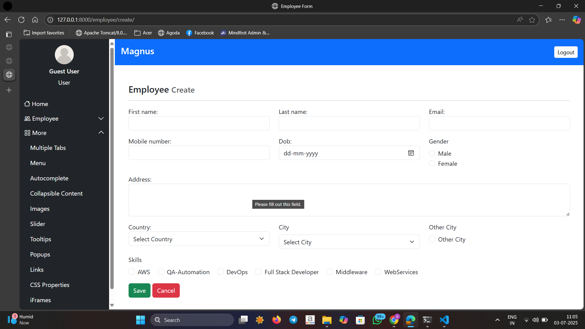
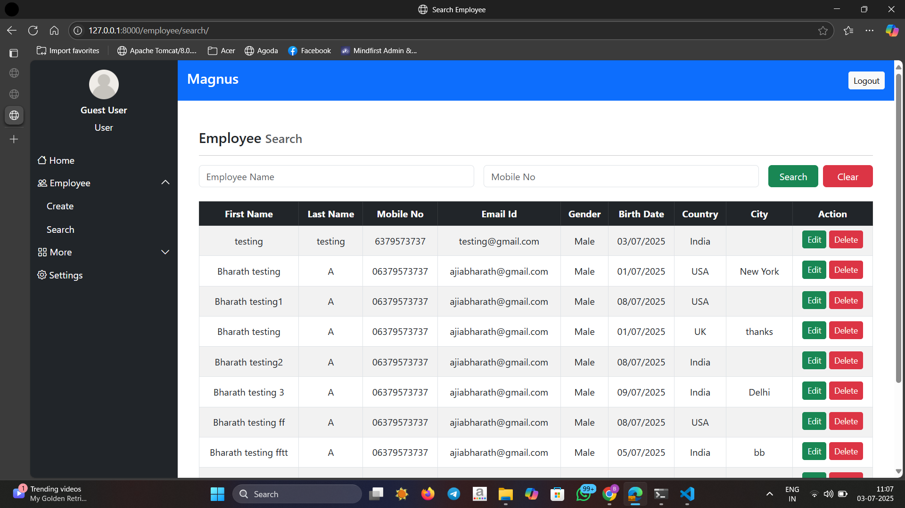
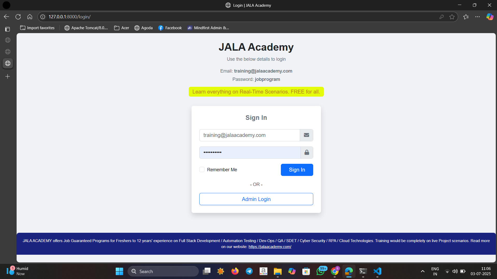

---

## 🚀 Features

- 🔐 User Login & Logout  
- 👨‍💼 Employee Create / Search / Delete  
- 📁 Image Upload & Display  
- 🧩 Bootstrap Tabs, Alerts, Tooltips, and more  
- 🌐 Collapsible Menus with Icons  
- 🧠 Tags (Single and Multi-value)  
- 📊 Status and Error Code Examples  
- 💡 Tooltips, Slider, Popup, iFrames

---

## 🖼️ Screenshots


**🔵 Employee Create**  


**🟢 Employee Search**  


**🟡 Login Example**  


---

## 🛠️ Tech Stack

- **Backend:** Django 5.2.3, SQLite  
- **Frontend:** Bootstrap 5, HTML5, CSS3  
- **Auth:** Django Auth System  
- **Icons:** Bootstrap Icons

---

## ✅ How to Run

```bash
# 1. Clone the repo
git clone https://github.com/Bharath8992/jala-academy-magnus.git
cd magnus-project

# 2. Create a virtual environment
python -m venv venv
source venv/bin/activate   # For Linux/macOS
venv\Scripts\activate      # For Windows

# 3. Install dependencies
pip install -r requirements.txt

# 4. Run the server
python manage.py runserver
